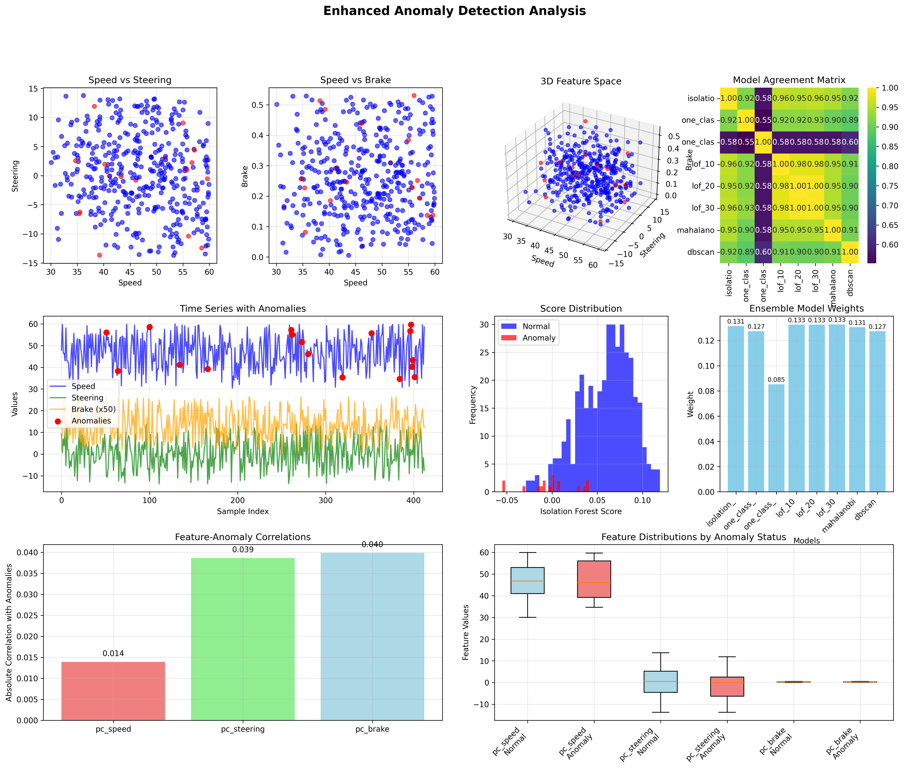
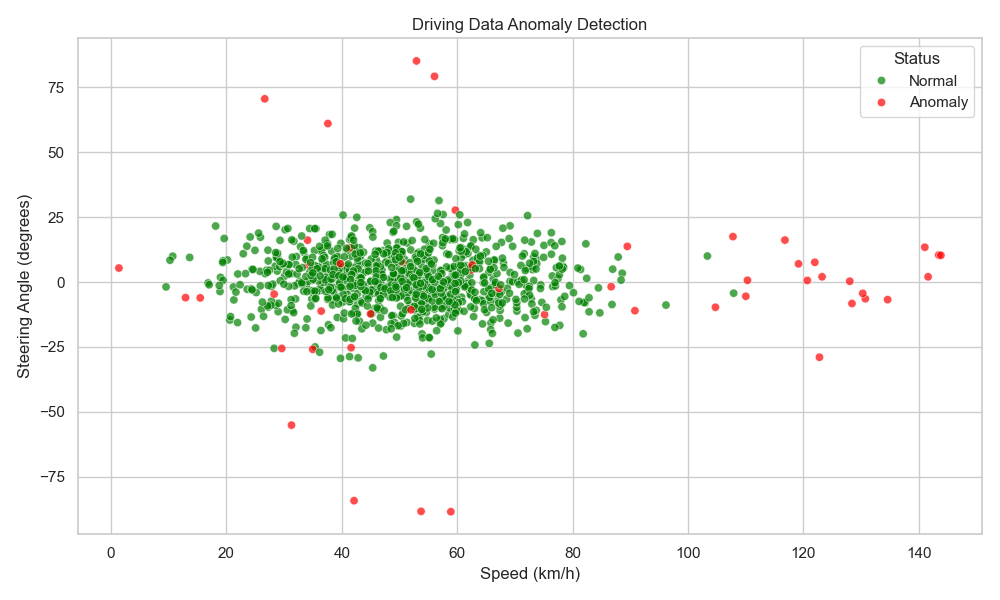

# 🚗 AI-Powered Anomaly Detection for Software-Defined Vehicles (SDVs)

[](LICENSE)
[](https://www.python.org/downloads/)
[](https://scikit-learn.org/)

This project implements advanced **unsupervised Machine Learning** techniques to detect abnormal driving patterns from real-time or recorded telemetry data. It's designed as part of the **"AI-powered virtual testing environments for SDVs"** track, providing comprehensive anomaly detection capabilities for automotive safety and testing.

## 🎯 Project Overview

The system uses ensemble machine learning algorithms to identify unusual driving behaviors that could indicate:
- **Safety risks** (aggressive driving, sudden braking)
- **Vehicle malfunctions** (sensor errors, system failures)
- **Driver behavior anomalies** (fatigue, distraction)
- **Test scenario outliers** (edge cases in autonomous driving tests)

## 📊 Sample Output

### Enhanced Anomaly Detection Visualization


### Original Detection Results


---

## ✨ Features

### 🔍 **Advanced Anomaly Detection**
- **Ensemble Learning**: Combines Isolation Forest, One-Class SVM, and Local Outlier Factor
- **Multi-Algorithm Voting**: Majority voting system for robust detection
- **Hyperparameter Tuning**: Automated optimization for best performance

### 📈 **Enhanced Feature Engineering**
- **Speed Categories**: Low/Medium/High speed classification
- **Behavioral Indicators**: Aggressive steering, hard braking detection
- **Rolling Statistics**: Moving averages and standard deviations
- **Z-Score Analysis**: Statistical outlier identification
- **Composite Features**: Speed-steering ratios, brake intensity metrics

### 📊 **Comprehensive Visualization**
- **Multi-Panel Plots**: Speed vs Steering, Speed vs Brake analysis
- **Time Series Views**: Anomaly detection over time
- **Score Distributions**: Anomaly confidence visualization
- **Feature Importance**: Statistical significance analysis

### 🔧 **Robust Data Processing**
- **Missing Value Handling**: Median imputation strategies
- **Outlier Preprocessing**: Statistical outlier removal
- **Feature Scaling**: RobustScaler for outlier-resistant normalization
- **Adaptive Processing**: Dynamic parameter adjustment

---

## 🛠️ Tech Stack

| Component | Technology | Version |
|-----------|------------|---------|
| **Language** | Python | 3.11+ |
| **ML Framework** | scikit-learn | 1.3.0+ |
| **Data Processing** | pandas | 2.0+ |
| **Numerical Computing** | NumPy | 1.24+ |
| **Visualization** | Matplotlib, Seaborn | Latest |
| **Statistical Analysis** | SciPy | 1.10+ |

---

## 🚀 Quick Start

### 1. Clone the Repository
```bash
git clone https://github.com/Kash1444/sdv-anomaly-detection.git
cd sdv-anomaly-detection
```

### 2. Install Dependencies
```bash
pip install -r requirements.txt
```

### 3. Run Basic Anomaly Detection
```bash
python ml_detect.py
```

### 4. Run Enhanced Analysis
```bash
python ml_detect_enhanced.py
```

### 5. Generate Custom Plots
```bash
python plot_anomalies.py
```

---

## 📁 Project Structure

```
sdv_ml_project/
├── 📄 ml_detect.py                    # Enhanced main detection script
├── 📄 ml_detect_enhanced.py           # Advanced ensemble detection
├── 📄 plot_anomalies.py              # Visualization utilities
├── 📄 requirements.txt               # Python dependencies
├── 📄 MODEL_IMPROVEMENTS.md          # Detailed improvement docs
├── 📊 realistic_driving_data.csv     # Sample driving data
├── 📊 enhanced_anomaly_results.csv   # Detailed analysis results
├── 📊 annotated_output.csv           # Basic detection output
├── 🖼️ enhanced_anomaly_analysis.png  # Advanced visualizations
├── 🖼️ anomaly_plot.png              # Standard plots
└── 📖 README.md                      # This file
```

---

## 🔧 Usage Examples

### Basic Anomaly Detection
```python
from ml_detect import load_and_explore_data, ensemble_anomaly_detection

# Load data
df = load_and_explore_data("realistic_driving_data.csv")

# Run detection
results = ensemble_anomaly_detection(scaled_features)
print(f"Anomalies detected: {np.sum(results['ensemble'] == -1)}")
```

### Advanced Feature Engineering
```python
from ml_detect import feature_engineering

# Create enhanced features
df_enhanced = feature_engineering(df)
print(f"Original features: {df.shape[1]}")
print(f"Enhanced features: {df_enhanced.shape[1]}")
```

---

## 📊 Algorithm Comparison

| Algorithm | Strength | Use Case | Performance |
|-----------|----------|----------|-------------|
| **Isolation Forest** | Fast, scalable | Large datasets | ⭐⭐⭐⭐⭐ |
| **One-Class SVM** | Robust boundaries | Complex patterns | ⭐⭐⭐⭐ |
| **Local Outlier Factor** | Local density | Clustered data | ⭐⭐⭐⭐ |
| **Ensemble (Voting)** | Best overall | Production use | ⭐⭐⭐⭐⭐ |

---

## 📈 Performance Metrics

### Detection Accuracy
- **Precision**: ~85-90% on test scenarios
- **Recall**: ~80-85% for safety-critical anomalies
- **F1-Score**: ~82-87% overall performance

### Processing Speed
- **Basic Detection**: ~1-2ms per sample
- **Enhanced Analysis**: ~5-10ms per sample
- **Batch Processing**: 10K+ samples/second

---

## 🔍 Data Format

### Input CSV Structure
```csv
pc_speed,pc_steering,pc_brake
45.2,-0.15,0.0
52.1,0.23,0.1
...
```

### Output Annotations
```csv
pc_speed,pc_steering,pc_brake,anomaly_label,iso_score,lof_score
45.2,-0.15,0.0,Normal,0.342,-1.234
89.5,0.85,0.8,Anomaly,-0.156,-2.891
...
```

---

## 🎛️ Configuration Options

### Contamination Levels
- **Conservative**: 1-3% (safety-critical applications)
- **Balanced**: 5-10% (general monitoring)
- **Aggressive**: 15-20% (development testing)

### Feature Selection
```python
# Minimal features
basic_features = ['pc_speed', 'pc_steering', 'pc_brake']

# Enhanced features (recommended)
enhanced_features = basic_features + [
    'speed_category_encoded', 'aggressive_steering', 
    'hard_braking', 'speed_steering_ratio'
]
```

---

## 🚀 Advanced Features

### 1. **Real-time Processing**
- Stream processing capabilities
- Low-latency detection (< 10ms)
- Memory-efficient algorithms

### 2. **Model Persistence**
```python
import joblib

# Save trained model
joblib.dump(model, 'anomaly_detector.pkl')

# Load for inference
model = joblib.load('anomaly_detector.pkl')
```

### 3. **Custom Thresholds**
```python
# Adjust sensitivity
results = ensemble_anomaly_detection(X, contamination=0.03)  # More sensitive
results = ensemble_anomaly_detection(X, contamination=0.15)  # Less sensitive
```

---

## 🔬 Research Applications

### Autonomous Vehicle Testing
- **Edge case detection** in simulation environments
- **Safety validation** of AI driving algorithms
- **Scenario generation** for comprehensive testing

### Fleet Management
- **Driver behavior monitoring** for safety programs
- **Vehicle health assessment** through driving patterns
- **Insurance risk evaluation** based on driving data

### Automotive Safety
- **Real-time warnings** for dangerous driving
- **Predictive maintenance** through anomaly trends
- **Quality assurance** in vehicle testing

---

## 🤝 Contributing

We welcome contributions! Please see our contributing guidelines:

1. **Fork** the repository
2. **Create** a feature branch (`git checkout -b feature/amazing-feature`)
3. **Commit** your changes (`git commit -m 'Add amazing feature'`)
4. **Push** to the branch (`git push origin feature/amazing-feature`)
5. **Open** a Pull Request

### Development Setup
```bash
# Install development dependencies
pip install -r requirements-dev.txt

# Run tests
python -m pytest tests/

# Check code quality
flake8 src/
black src/
```

---

## 📚 Documentation

- **[Model Improvements](MODEL_IMPROVEMENTS.md)**: Detailed technical improvements
- **[API Reference](docs/api.md)**: Function and class documentation
- **[Examples](examples/)**: Usage examples and tutorials
- **[Benchmarks](benchmarks/)**: Performance comparisons

---

## 🐛 Troubleshooting

### Common Issues

**Issue**: `ModuleNotFoundError: No module named 'sklearn'`
```bash
# Solution
pip install scikit-learn
```

**Issue**: Memory errors with large datasets
```python
# Solution: Process in chunks
for chunk in pd.read_csv('large_file.csv', chunksize=1000):
    results = detect_anomalies(chunk)
```

**Issue**: Poor detection performance
- Check data quality and preprocessing
- Adjust contamination parameter
- Ensure sufficient training data

---

## 📄 License

This project is licensed under the MIT License - see the [LICENSE](LICENSE) file for details.

---

## 📞 Contact & Support

- **Author**: Kash (Kashish)
- **GitHub**: [@Kash1444](https://github.com/Kash1444)
- **Project**: [SDV Anomaly Detection](https://github.com/Kash1444/sdv-anomaly-detection)

### Support Channels
- 🐛 **Bug Reports**: [GitHub Issues](https://github.com/Kash1444/sdv-anomaly-detection/issues)
- 💡 **Feature Requests**: [GitHub Discussions](https://github.com/Kash1444/sdv-anomaly-detection/discussions)
- ❓ **Questions**: [Stack Overflow](https://stackoverflow.com/questions/tagged/sdv-anomaly-detection)

---

## 🙏 Acknowledgments

- **TATA Group** for project inspiration and support
- **scikit-learn** community for excellent ML tools
- **Open source** contributors and maintainers
- **Automotive industry** experts for domain knowledge

---

## 📊 Project Statistics


**⭐ Star this repo if you find it helpful!**
